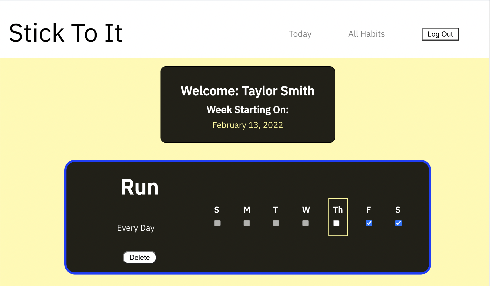
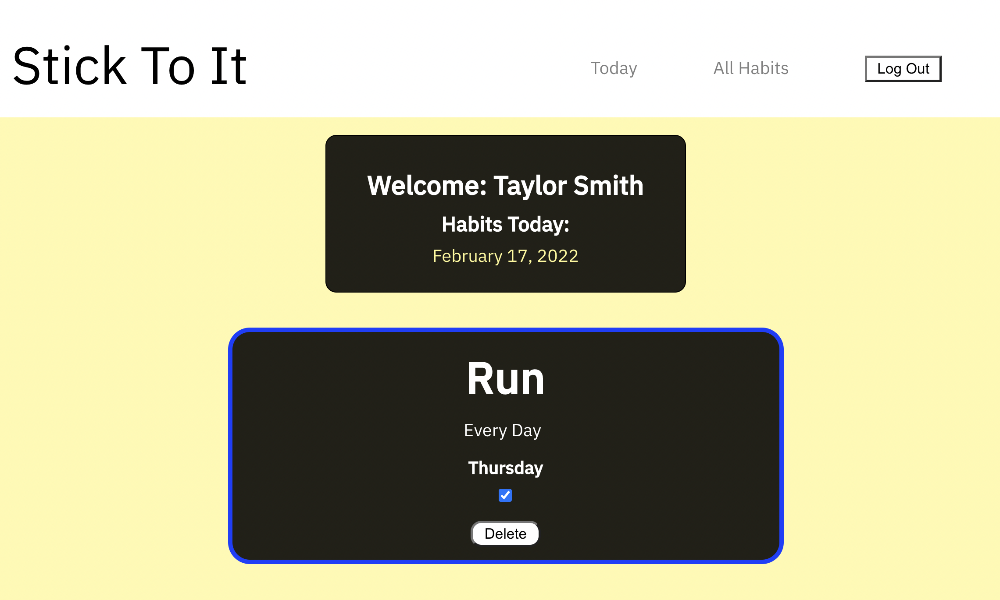
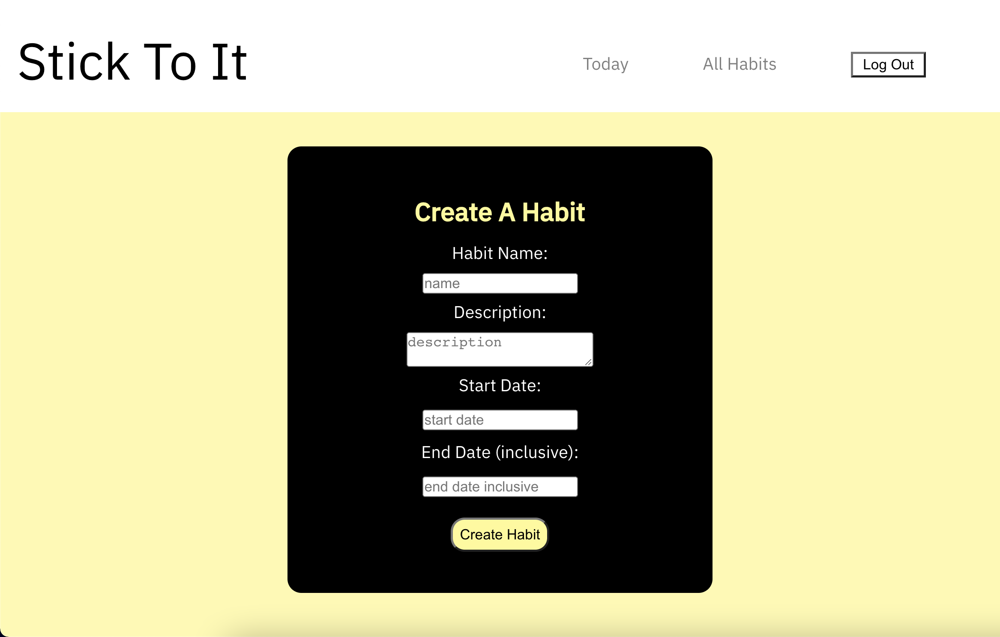
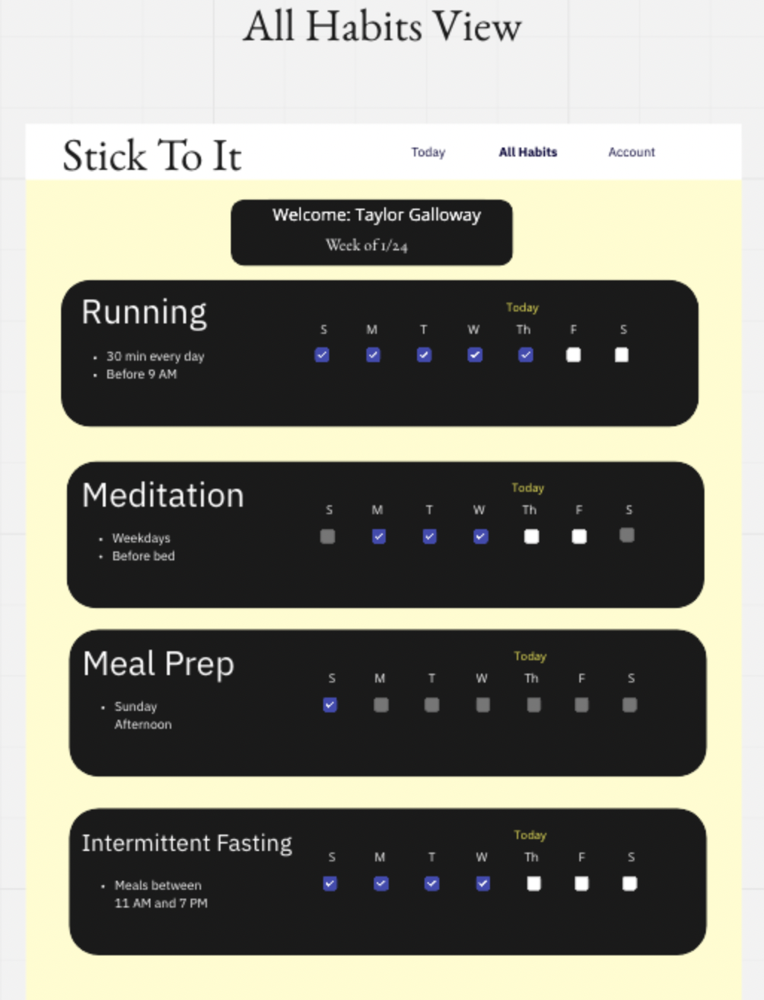
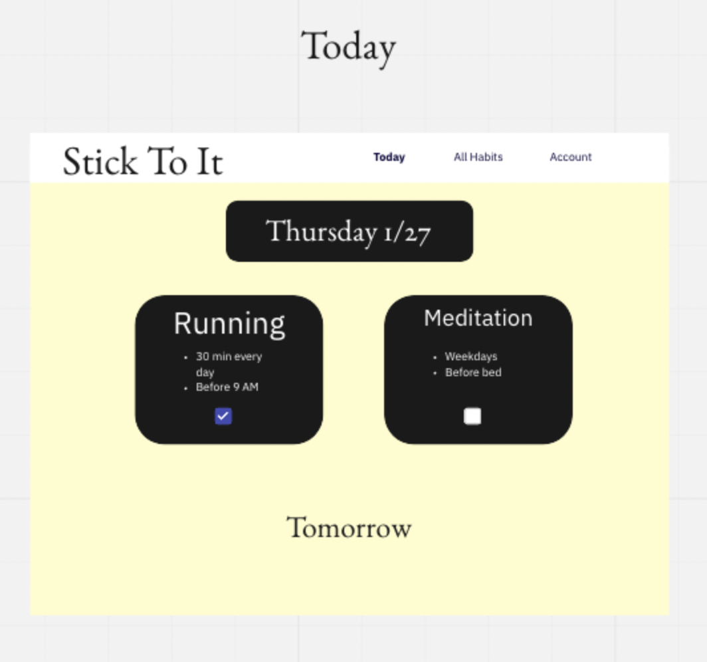

# Stick To It

#### View App: [https://stick-to-it-ui.herokuapp.com/](https://stick-to-it-ui.herokuapp.com/)

#### Back-End Repo: [https://github.com/tylrs/stick_to_it_api](https://github.com/tylrs/stick_to_it_api)

### Table of Contents

- [Overview](#overview)
- [Installation & Viewing](#installation-and-viewing)
- [Technologies Used](#technologies-used)
- [Features](#features)
- [Screenshots](#screenshots-and-gifs)
- [Wireframes](#wireframes)
- [Future Additions](#future-additions)

## Overview

- Stick To It is a web application for users to keep track of their habits.

## Installation and Viewing

This application is deployed to Heroku. You may view the live application [here](https://stick-to-it-ui.herokuapp.com/)

To view this application on your local device:

- Clone down this repository
- Run `npm i` in your terminal
- Run `npm start` in your terminal
- To view Cypress tests open a separate terminal window and run `npm run test`

### Technologies Used

 
    
    
    
    
    
    

## Features

- Users can create accounts and securely log in
- Users can log out
- Users can create and delete habits
- Users can see the habits they need to complete for a week
- Users can mark habits as complete or incomplete for a given day
- Users can see which habits they have scheduled for the given day
- Users can see errors when forms are completed incorrectly

## Sample Profile Screenshots and GIFs

---

## Wireframes

- All Habits Wireframe:
  
- Today Habits Wireframe:
  

## Future Additions

- Connecting users together as partners on habits
- Customizing frequency of habits
- Have multiple levels of intensity for habits which increase on certain dates

- ***

  **[Back to top](#table-of-contents)**
